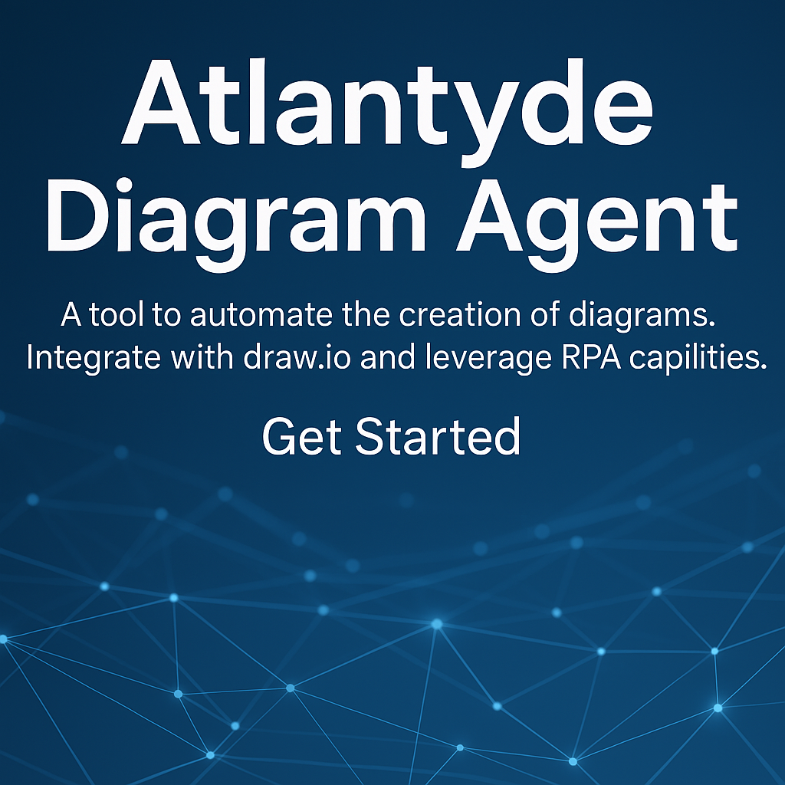

# 🌊 Atlantyde Diagram Agent

> **Tip:** Esta documentación se genera automáticamente y crece con cada PR. Revisa [Colabora](docs/collabora/colabora.md) para empezar.

Automatiza, documenta y visualiza tus flujos técnicos con un enfoque de colaboración abierta.

## 🚀 Navega por el conocimiento

- [🧭 Primeros Pasos](getting-started/overview.md)
- [📘 Guía de Usuario](user-guide/user-guide-overview.md)
- [🧪 QA/UAT Reportes](qa-uat-report/generated/index.md)
- [🔐 Seguridad](security.md)
- [📚 Referencias Técnicas](api.md)
- [👥 Cómo Colaborar](docs/collabora/contibuting.md)

---

> Automatización. Visualización. Seguridad. Colaboración.
>
> **Atlantyde Diagram Agent** es un proyecto de código abierto que transforma procesos técnicos y documentales en flujos visuales, seguros y auditables gracias a la integración de herramientas como DrawIO, ShellCheck, GitHub Actions y DevSecOps.

---

## 🚀 ¿Qué puedes hacer con Atlantyde?

- ✨ Exportar diagramas `.drawio` automáticamente a PDF
- 🔍 Analizar scripts Bash con ShellCheck y obtener reportes en SARIF y HTML
- 📊 Documentar visualmente pipelines, infraestructuras o sistemas complejos
- 🤖 Automatizar la generación de documentación en CI/CD
- 🔐 Asegurar la trazabilidad y cumplimiento SDLC en cada fase

---

## 🧭 Navegación Rápida

| Sección              | Descripción                                                  |
|----------------------|--------------------------------------------------------------|
| [Getting Started](getting-started/overview.md) | Configura el agente paso a paso                        |
| [User Guide](user-guide/user-guide-overview.md) | Aprende a usar las funciones clave                    |
| [Features](user-guide/features.md) | Descubre lo que hace único a Atlantyde                |
| [Usage](usage.md) | Guía de uso básica y avanzada                          |
| [CI/CD](colabora/ci-cd.md) | Automatiza la integración y el despliegue             |
| [Security](security.md) | Refuerza la ciberseguridad en tus procesos         |
| [GitHub Pages](github-pages.md) | Publica documentación viva directamente desde GitHub  |

---

## 💡 ¿Por qué "Atlantyde"?

Inspirado en el mito de la Atlántida, **este proyecto busca recuperar la belleza, el orden y la colaboración entre humanos y sistemas inteligentes**. Una documentación viva que une lo técnico y lo visual.

---

## 🤝 ¿Quieres contribuir?

Consulta la [Guía de Contribución](colabora/contributing.md) para colaborar creando documentación, mejoras técnicas o visuales.

---

Atlantyde © 2025 • _Software libre para una documentación poderosa y accesible._
